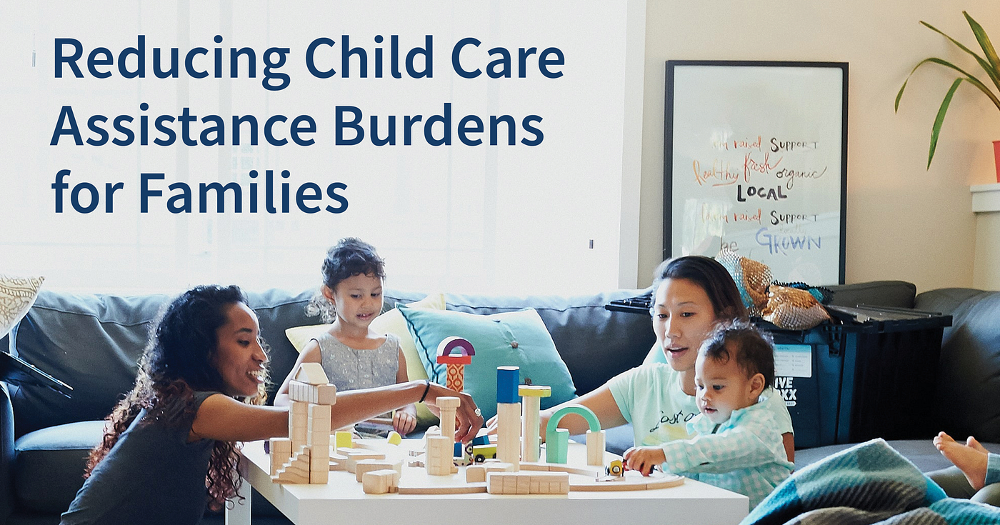
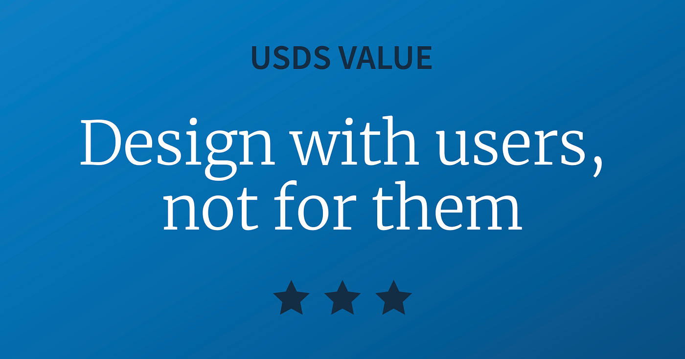

---
# Page template info (DO NOT EDIT)
layout: default
blog_page: true

# Carousel (Edit this)
carousel_title: "Reducing burden of child care assistance applications"
carousel_summary: "Nearly one million American families benefit from federally funded child care assistance. But it’s often difficult for families to navigate an application process that can be confusing and unnecessarily hard."
# partial path to image
carousel_image: blog_posts/2023-03-29-reducing-burden-of-child-care-assistance-applications-img/carousel_8HnacQ.jpg
# accessibility text for image
carousel_image_alt_text: ""
# should show on news and blog page. ordered by date prefix in filename
carousel_show: true

# Blog detail page (Edit this)
title: "Reducing burden of child care assistance applications"
dateline_str: "Mar 29, 2023"
readtime_str: "4"
byline_str: "Allison Abbott, Coulton Bunney, T. Annie Nguyen, and Pooja Shaw"
permalink: blog_posts/reducing-burden-of-child-care-assistance-applications
---

Nearly one million American families benefit from federally funded child care assistance. But it’s often difficult for
families to navigate an application process that can be confusing and unnecessarily hard, and for staff working in
states to quickly approve those applications.

The U.S. Digital Service partnered with the Office of Child Care (OCC), which is part of the Department of Health and
Human Services’ Administration for Children and Families (ACF), to tackle this process. The result,
the [Guide to Creating a Family Friendly Child Care Assistance Application](https://childcareta.acf.hhs.gov/creating-family-friendly-child-care-assistance-application),
will help reduce the burden and break down the barriers for families that need child care assistance.

## What’s Child Care Assistance?

This [program](https://childcareta.acf.hhs.gov/ccdf-fundamentals/ccdf-program) helps families with lower incomes pay for
child care so parents can work, pursue an education, or attend job training.

Though the program is federally funded, each state, territory, or Tribal Nation is responsible for administering the
program. They must create their own application, collect applications from families, determine whether a family meets
the eligibility criteria, and send payments to providers.

Many states take different approaches to the application process. For example, some states require an in-person
interview or an original, hard-copy birth certificate — requirements that can make it harder for families who need this
assistance to attend a job interview, complete their degree, or go to work.

### Our Research

We approached this project with a focus on what peoples’ actual experience is with the application, first working to
understand what wasn’t working well — both for families using the application and for staff reviewing applications.

The team noticed that state applications ranged in length, layout, and the content of the questions that states were
asking families. Some applications were one page; others were 16 pages.

We heard from families during our research that gathering the information needed to complete long, complicated
applications could be daunting when you’re also managing children at home and looking for child care.

State administrators, too, weren’t satisfied with the applications, which often included questions that neither
administrators nor families understood. It was unclear to them what parts of the application were required by law, such
as which family members should be included in the application and what documentation is required.

If the application is confusing for families, it’s also more prone to errors. We learned that families are frequently
confused about which family members needed to be on the application, which personal information is needed from those
family members, and what counts as income, among other questions — and so families don’t always accurately reflect their
situation in applications. Frontline staff reviewing the applications then spend more time working with families to
clarify details and figure out who actually qualifies.

## Designing a New Application Model

The teams at USDS and ACF worked together to provide a sample application for interested states along with clarifying
the verification and documentation requirements that were unclear.

Designers applied user experience best practices to create
a [Model Child Care Assistance Application](https://childcareta.acf.hhs.gov/full-model-application) that clearly
describes what information is required to meet all federal requirements. It also demonstrates best practices for
designing an easy-to-use form and process — for example, allowing for flexibility when families have a non-standard
income or non-traditional living arrangements, or automatically skipping certain questions if those questions don’t
apply to the applicant.

Designers also tested the new application with real families to see where they got stuck or where they had questions,
which informed the Model Application.

In [keeping with our value](/mission#our-values) to “design with users, not for them,” we made sure to not only speak
with families and states during the research phase, but to also continually involve them in the design process and show
them drafts of the product as we created it.

## Using the Guide

Ultimately, it’s up to each state to adopt the recommendations
in [the Guide](https://childcareta.acf.hhs.gov/creating-family-friendly-child-care-assistance-application).

Our research showed that state administrators want to make applications easier, but are often unsure what’s allowed
under the federal program. We partnered with the policy and subject matter experts at ACF to create a Model Child Care
Assistance Application and eligibility verification practices that meet federal guidelines and show the “art of what’s
possible.”

Already state child care offices have expressed interest in this work. They’re also expanding support resources to help
put these practices to work and improve efforts to reduce burden on working families.

~

_If you’d like to work on projects like this, consider joining USDS! We’re hiring mission-driven engineers, product
managers, designers, bureaucracy hackers, procurement specialists, and operations experts who want to make an impact on
the lives of their fellow Americans. [Apply here](/apply)._
